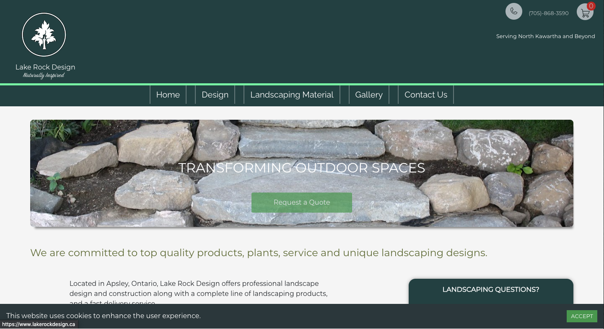
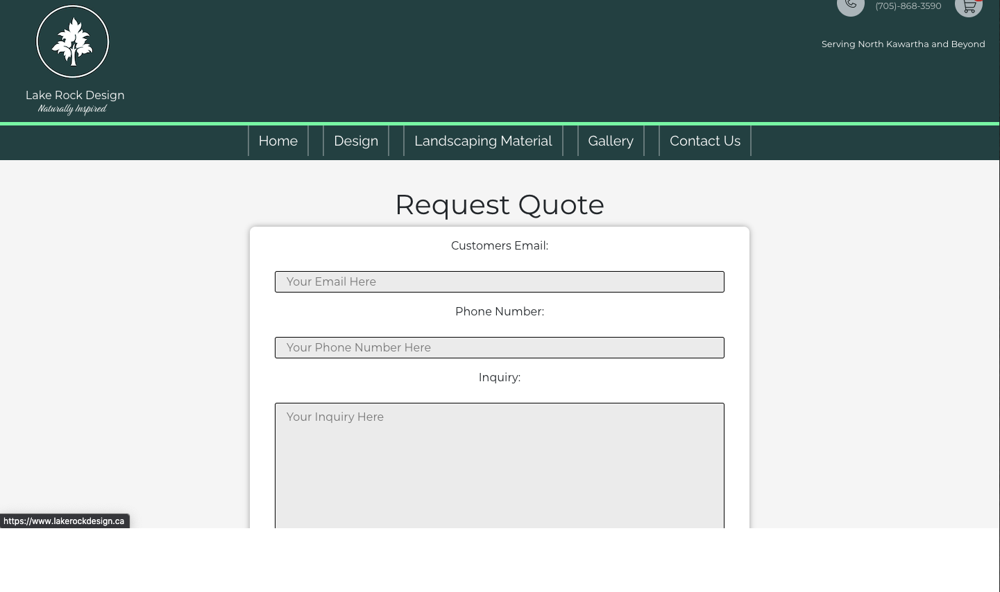
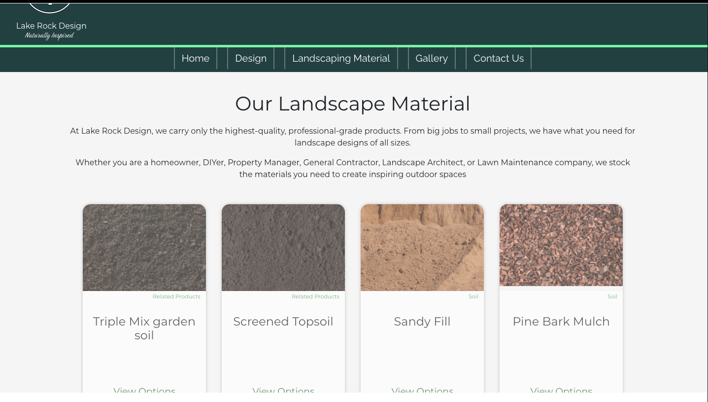
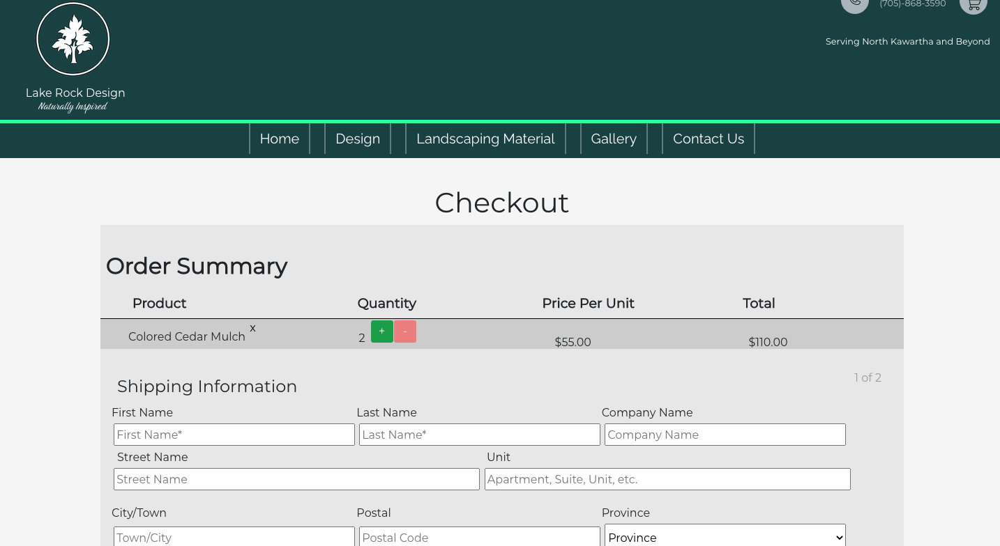

# Lake Rock Design 
A E-Commerce and Professional website for a Landscaping and Landscaping supply Company based in Central Ontario.
## Live 

  [www.lakerockdesign.ca/](https://www.lakerockdesign.ca/)
## Screenshots
#### Screenshot of Homepage

#### Screenshot of Requesting a Quote

#### Screenshot of Store Page

#### Screenshot of Item Page

#### Screenshot of Checkout

## Tech Stack
* Front-End: HTML, CSS, React, Bootstrap.

* Back-end: Ruby on Rails API, Postgres.

<!-- * Testing: Jest, Storybook, and Cypress. -->

## Setup

* Install dependencies with `npm install`.
* Fork & Install dependencies for Backend [here](https://github.com/kylemcloughlin/dulder_landscaping_api)
* Run `rails s -p 3001` - Backend
* Run `npm start` - Frontend

## Dependencies 
  * axios -  ^0.21.4
  *  react - ^17.0.2
  *  react-burger-menu - ^3.0.6
  *  react-cookie - ^4.1.1
  *  react-cookie-consent - ^6.4.1
  *  react-dom - ^17.0.2
  *  react-grid-gallery - ^0.5.5
  *  react-helmet - ^6.1.0
  *  react-router-dom - 5.2.0
  *  react-scripts - 4.0.3
  *  web-vitals - ^1.0.1
 
 ## DevDependencies 
  * @stripe/react-stripe-js - ^1.4.1
  * @stripe/stripe-js - ^1.17.0
  * @testing-library/jest-dom - ^5.11.4
  * @testing-library/react - ^11.1.0
  * @testing-library/user-event - ^12.1.10
  * @babel/core - ^7.4.3
  * @testing-library/jest-dom - ^4.0.0
  * @testing-library/react - ^8.0.7
  * @testing-library/react-hooks - ^5.1.1
  * babel-loader - ^8.0.5

